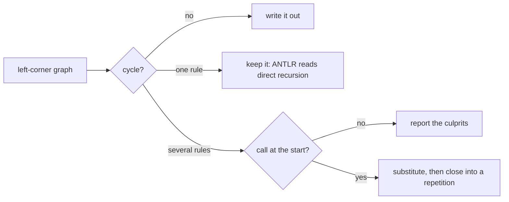

# The ANTLR generator

```
pyperg generate mygrammar.mgff -g antlr -o out/
```

This backend writes a **combined ANTLR 4 grammar**: one `.g4` file holding the
parser rules in lower case and the lexer rules in upper, which is the arrangement
ANTLR's own tooling expects. The file is named after the grammar, because ANTLR
requires it.

Of all the backends this is the closest fit. ANTLR's lexer and parser are MGFF's
two phases, its labels are `store` and `push`, and its alternation is MGFF's
order-based choice exactly. Where the two notations do differ, the difference is
reported rather than papered over.

---

## The grammar it reads

**Two phases, and the last is `Parse`.** The first phase reads characters and
becomes the lexer; `Parse` reads what it produced and becomes the parser. That is
the whole of what ANTLR has, so a grammar of one phase or of three is reported.

```mgff
t Lex (
    d Number = ( 0-9 )+
             > class(Number) push(tokens)
    ...
)

t Parse (
    > post(Lex) over(tokens)
    ...
)
```

`over(tokens)` is what lets the parser write `\(` and mean *the token whose class
is `\(`*. A `Parse` phase without it re-reads the text, which ANTLR cannot do; a
fixed string there becomes an inline literal instead, for which ANTLR creates an
implicit token of its own. That is how a grammar writes `'(' expr ')'` and never
names the brackets — and it is worth knowing that an implicit literal wins over a
broader lexer rule covering the same text, which ANTLR will point out.

**Parametrized macros need no thought.** A call carrying arguments is spelled out
where it is written, long before this backend sees it, so `sep(Expr)by(,)` arrives
as the rule it stands for. ANTLR has no macros and needs none.

## Tokens, fragments and channels

A lexer production is a **token** when it says so, and everything else is a
`fragment` — a piece that exists to be spelled into the rules calling it. Both of
MGFF's ways of saying it are read:

```mgff
d Int = ( Digit )+          d Number = ( 0-9 )+
      > token                        > class(Number) push(tokens)
```

The first is the calculator of the specification's Appendix A. The second is what
a phase reading `over(tokens)` needs anyway, since a class is how the parser finds
the token again.

```mgff
d Digit = 0-9
d Int   = ( Digit )+
        > token
```

```antlr
INT : DIGIT+ ;

fragment DIGIT : [0-9] ;
```

A fragment produces no token, so the parser cannot call one; doing so is
reported, and the fix is to write `> token` on it.

**`skip` throws the match away**, and becomes ANTLR's own command. `skip(false)`
says the opposite, which is how one production opts out of a shared attribute
list that skips.

```mgff
d Space = ( \_|\t|\n )+
        > token skip
```

```antlr
SPACE : [ \t\n]+ -> skip ;
```

**A second `push` is a channel.** The list the parser reads is the token stream
itself; any other list a lexer production pushes to is a match kept but not
parsed, which is what an ANTLR channel is for. One grammar file has one such
channel — ANTLR's predefined `HIDDEN`, since a `channels { … }` block belongs to a
`lexer grammar` alone — so one list may ask for it.

```mgff
d Comment = # ( Letter|Decimal_Number|\_|\t )*
          > autoclass push(tokens) push(comments)
```

```antlr
COMMENT : '#' [\p{L}\p{Nd} \t]* -> channel(HIDDEN) ;
```

The tokens are written in the order the grammar wrote them, which matters: ANTLR
matches the longest token it can and breaks a tie between two rules by which was
written first.

## Where a match goes

`store` and `push` become ANTLR's two label operators, and the label appears at
every call, since in MGFF it belongs to the rule rather than to the place it is
used.

```mgff
d Argument = Expr
           > store(value)

d File = ( Argument ( , Argument )* )?
```

```antlr
file : ( value+=argument ( COMMA value+=argument )* )? ;
```

`store` gives `=` and `push` gives `+=`, with one adjustment: a field a
repetition matches more than once has to be `+=` throughout, which ANTLR insists
on and which is what the field means anyway. `push` to the list the parser reads
is the phase's own plumbing and names no field.

## Left recursion

**Direct left recursion is left as written.** ANTLR 4 reads it, and derives
precedence and associativity from the order of the alternatives, which is the
idiomatic way to spell an expression grammar and produces a better parse tree
than any rewriting would.

```mgff
d Expr = Expr Star Expr
       / Expr Plus Expr
       / Number
       / \( Expr \)
```

```antlr
expr
  : expr STAR expr
  | expr PLUS expr
  | NUMBER
  | LPAREN expr RPAREN
  ;
```

`1+2*3` then parses as `1 + (2*3)`, because `Star` was written above `Plus`.

**Indirect left recursion is rewritten**, since ANTLR refuses a cycle running
through more than one rule: there is no single rule for it to work on. The cycle
is removed the classical way. Each member in turn is spelled into the next, which
turns the cycle into direct recursion, and that recursion is then closed into a
repetition so the next substitution cannot bring it back.

```
A = A α | β   ⇒   A : β ( α )* ;
```



The cycles are looked for in the **left-corner** graph rather than the call
graph: a rule calling another at the end of an alternative is no left recursion,
and a rule reached past something that may match nothing is.

Within a rewritten cycle the order of alternatives does not survive — the
substitution rewrites them, and there is nothing left for `/` and `|` to attach
to. Outside one, both markers keep their meaning.

Every production at fault is named, not only the first:

```
error: ANTLR cannot read the left recursion in this grammar:
  Expr: every alternative recurses, so it never ends
```

| Reason                                                                          | What it means                                     |
| ------------------------------------------------------------------------------- | ------------------------------------------------- |
| every alternative recurses, so it never ends                                    | the rule has no way to stop, as in `d A = A + A`   |
| an alternative is nothing but the recursive call                                | `d A = A`, which describes nothing                 |
| a recursive call is reached through a group, or past something that may match nothing | the call is not at the edge, as in `d A = ( A + )? b` |

## Matching characters

A character set becomes an ANTLR lexer set, part for part — neither notation has
a negation, so the two agree. A Unicode category becomes `\p{Lu}`, and a set of
one character becomes a literal, which reads better and is the one form a parser
rule accepts too.

| MGFF                    | ANTLR              |
| ----------------------- | ------------------ |
| `a`                     | `'a'`              |
| `a-z\|A-Z\|_`           | `[a-zA-Z_]`        |
| `Lu\|Decimal_Number`    | `[\p{Lu}\p{Nd}]`   |
| `< =`                   | `'<='`             |

**MGFF has no literal longer than one character**, so `< =` arrives as two items
and is fused back into one literal before it is written. Without that every
operator would go out as a run of one-character literals.

A set of more than one character is a lexer rule's business: the parser reads
tokens and has no character to match, so a set written there is reported, and the
fix is to give it a lexer rule of its own.

### Choice and preference

MGFF's `/` takes the first alternative that succeeds, which is exactly what
ANTLR's alternation does. It maps precisely.

MGFF's `|` takes the **longest** match. In the lexer that maps precisely too, for
a different reason: ANTLR matches the longest alternative of a lexer rule
whatever order they are written in. In the parser it cannot be said, so the
longest fixed option is written first — enough to make `<=` win over `<`, which
is the case the marker exists for, and an approximation otherwise.

## A worked example

```mgff
> name(Demo)

t Lex (
    d Digit  = 0-9
    d Number = ( Digit )+
             > class(Number) push(tokens)
    d Plus   = +
             > class(+) push(tokens)
    d Star   = *
             > class(*) push(tokens)
    d LParen = \(
             > class(\() push(tokens)
    d RParen = \)
             > class(\)) push(tokens)
    d Space  = ( \_|\t )+
             > class(Space) push(tokens) skip
)

t Parse (
    > post(Lex) over(tokens)

    d Expr = Expr Star Expr
           / Expr Plus Expr
           / Number
           / \( Expr \)
)
```

```antlr
grammar Demo;

// -- Parse ------------------------------------------------------------

expr
  : expr STAR expr
  | expr PLUS expr
  | NUMBER
  | LPAREN expr RPAREN
  ;

// -- Lex --------------------------------------------------------------

NUMBER : DIGIT+ ;

PLUS : '+' ;

STAR : '*' ;

LPAREN : '(' ;

RPAREN : ')' ;

SPACE : [ \t]+ -> skip ;

// -- fragments --------------------------------------------------------

fragment DIGIT : [0-9] ;
```

```sh
antlr4 -Dlanguage=Python3 -o generated Demo.g4
```

## Limitations

**A rule name may still clash with a target language.** The `.g4` file itself is
language-agnostic, and rule names are taken from the grammar's own macro names,
lowered for the parser and raised for the lexer. Some of ANTLR's target languages
reserve words of their own — a rule named `file` is fine for the default Java
target and is refused by the Python one — and where that happens ANTLR says so
and the macro can be renamed.

**ANTLR repeats an element none, once or many times.** It has no counted
repetition, so a bound other than `?`, `*` or `+` is reported.

**A grammar file has one channel besides the default.** Two lists asking for one
are reported; push what is kept but not parsed to a single list.

**The parser's start rule is not marked.** A `.g4` file names none, so the caller
picks the rule to begin at. `File` is written first when the grammar has one, and
nothing is anchored to the end of the input — append `EOF` to the start rule if
the whole of the text must be consumed.
