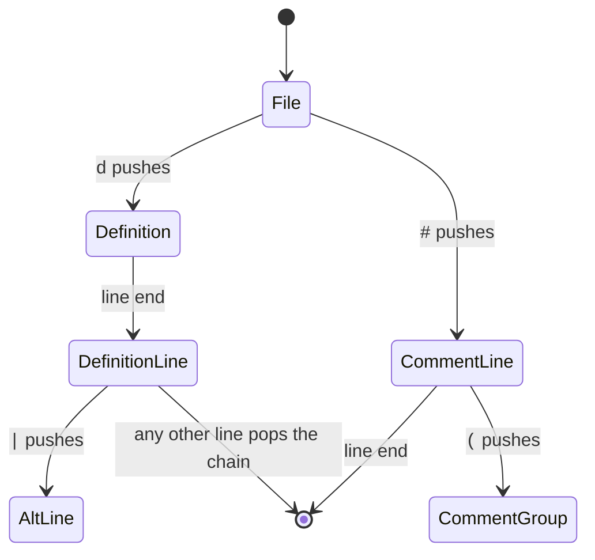

# The Kate generator

```
pyperg generate mygrammar.mgff -g kate -o out/
```

This backend writes a **KDE syntax definition**: the XML format that Kate,
KWrite and KDevelop read for syntax highlighting, and that pandoc reads through
skylighting when it highlights a fenced code block. One grammar gives one `.xml`
file, ready to drop into `~/.local/share/org.kde.syntax-highlighting/syntax/` or
to pass to `pandoc --syntax-definition`.

The backend reads the grammar's **chain of phases**, and every phase starts at a
macro named `File`. The chain is what `post(…)` on each target says, and it ends
at `Parse` — see *The phases it reads* below.

---

## How Kate highlights

Kate does not parse. It runs a stack of **contexts** over the text, one line at
a time. A context is an ordered list of rules; at each position Kate tries them
in order and the first one that matches wins, colouring what it matched and
optionally pushing another context, popping back, or staying put.



That machine reads nesting, which is why brackets and comments fold correctly in
Kate. What it cannot do is backtrack, or let a rule call itself. So:

- **The earlier phases map exactly.** A token is a regular pattern, and a
  regular pattern is precisely what a Kate rule matches.
- **The last phase maps closely.** Every context holds what its place in the grammar
  reaches, so a marker is a keyword only where a line may open with one and a
  group holds only what its own lines may hold. What Kate still cannot do is
  reject: the output highlights and folds what your grammar describes, but a
  malformed file is coloured all the same. If you need a real parser, that is
  what the other backends are for.

---

## The phases it reads

Every target names the phase it runs after, and the chain ends at `Parse`:

```mgff
t Lex (
    ...
)

t Parse (
    > post(Lex) over(tokens)
    ...
)
```

The first phase — the one with no `post` — reads the text. Each later one either
reads the text again, or reads the list an earlier phase filled with `push(…)`,
which is what `over(…)` says. A grammar of a single phase calls it `Parse`, and
becomes one flat context of the matches its `File` names.

What follows calls the first phase `Lex` and the last `Parse`, which is the usual
arrangement; nothing but the last name is fixed.

**What `over(…)` changes** is what a terminal of the later phase means. Where a
phase reads text, `\(` is that character; where it reads a list, it is *the match
whose class is `\(`*. So the earlier phase names what it produces —

```mgff
d LParen = \(
        > class(\() style(Normal) push(tokens)
```

— and the later phase goes on writing `\( Expr \)`, meaning the token. A
terminal naming a class nothing pushes is reported, which is what catches the
class misspelled on either side.

## The first phase

`File` is the starting production, and it lists the tokens in the order Kate
should try them:

```mgff
t Lex (
    d Digit = 0-9
    d Int   = ( Digit )+
            > style(DecVal)

    d File = ( (Space)/(Comment)/(Keyword)/(Int)/(Ident) )*
)
```

Mind the spelling of the choice: it carries no whitespace around its separator,
since a space there would split it into separate items.

Two things follow from writing it this way.

**Order is yours.** Kate takes the first rule that matches, so the order in
`File` is how you say that a keyword beats an identifier, or that a comment beats
an operator.

**Only what `File` names becomes a rule.** `Digit` above is a helper: it is
inlined into the expression for `Int` and never tried on its own. Nothing is
matched that the grammar did not ask for.

Inside a production, a length-based choice (`|`) is emitted longest match first,
so `<=` is tried before `<` without you having to order it by hand. An
order-based choice (`/`) is emitted as written.

A `Lex` production that reaches itself is an error: a Kate rule matches with an
expression, and an expression cannot recurse.

## The last phase

`File` is the starting production here too, and from it the backend derives a
**machine**: a set of contexts, where a context is *a place a line may begin*
and holds the rules its place in the grammar reaches — and nothing else.

That last part is what makes the output context-sensitive. A marker is a keyword
where a line may open with one and ordinary text everywhere else; a group whose
lines hold no definitions holds no `d` rule; a comment stays a comment across
the lines a group inside it spans.

A production becomes one of three things:

| Interpretation | Shape | Becomes |
| --- | --- | --- |
| Span | opens with a fixed character and closes with one | a context, pushed by the opening and popped by the closing, and a region that folds |
| Span | opens with a fixed character and runs to a line break | a context, pushed by the opening and popped where the line ends |
| Token | carries a `style` and has a regular form | one rule, coloured by its style |
| Transparent | anything else | nothing of its own; its parts belong to whoever reached it |

```mgff
t Parse (
    d Definition = DefMarker WS Head Gap EqualsMarker Items NL
    d Comment    = CommentMarker Items NL
                 > style(Comment)
    d Group      = \( Items \)
    d Line       = (Definition)/(Comment)
    d File       = ( (Line)/(NL) )*
)
```

`Definition` opens with `d` and runs to the line break, so `d` pushes a context
that pops where the line ends. `Comment` does the same and carries a class, so
everything that context holds is a comment — the lines a `Group` inside it
reaches included, since the group is a context of its own and Kate pops only the
context on top.

**A line role may reach past its first line.** A definition covers its `|`, `/`
and `>` lines, and those become a **chain**: the context of the first line names
the next in `lineEndContext`, that one loops on itself, and a line beginning with
something none of its rules knows pops the whole chain through a `lookAhead`
rule — so the scope below reads that line from its first character.

**A marker spelled as a letter matches between deliminators.** `d`, `t` and `p`
become `WordDetect` rather than `DetectChar`, so the `d` of `Digit` opens
nothing.

**`Lex` keeps two jobs**: the expression each token matches with, and the order
tokens are tried in where a context holds several. Since a context holds only
what it reaches, **`Parse` names every token it wants coloured** — the ones a
parser would skip among them:

```mgff
d Skipped = Space
          / Comment
```

A grammar of a single phase is a machine of one context, `Tokens`, built straight
from that order. A target that is on no chain — one nothing runs after, and that
runs after nothing — is reported: it would never run.

## Attributes

### `style(Style Qualifier …)`

Kate gives every rule an *itemData*, and every itemData a **default style** —
`dsKeyword`, `dsComment`, `dsString` and so on. A theme colours the default
styles, and skylighting maps them onto pandoc's token types. The default style
is therefore the whole of what a highlighted match *looks like*, and `style` is
how you choose one:

```mgff
d Keyword = i f
          | e l s e
        > style(Keyword)
```

gives

```xml
<keyword String="keyword" attribute="Keyword"/>
…
<itemData name="Keyword" defStyleNum="dsKeyword"/>
```

The first argument must name one of these, and the match ignores capitalisation,
so `style(keyword)` and `style(Keyword)` are the same thing:

| | | | |
| --- | --- | --- | --- |
| `Normal` | `Keyword` | `Function` | `Variable` |
| `ControlFlow` | `Operator` | `BuiltIn` | `Extension` |
| `Preprocessor` | `Attribute` | `Char` | `SpecialChar` |
| `String` | `VerbatimString` | `SpecialString` | `Import` |
| `DataType` | `DecVal` | `BaseN` | `Float` |
| `Constant` | `Comment` | `Documentation` | `Annotation` |
| `CommentVar` | `RegionMarker` | `Information` | `Warning` |
| `Alert` | `Error` | `Others` | |

Anything else is an error, naming the list: a misspelled style would otherwise be
silently invisible.

**Nothing is derived.** A production carrying no `style` is unstyled, and takes
the colour of whatever context it was reached from. That is exactly right for
whitespace and punctuation, and it means a token you *want* coloured always says
so.

**Qualifiers.** Kate allows one style per rule, so any further arguments are
qualifiers: they do not change the colour, and all the names are joined with `.`
to name the itemData.

```mgff
d If = i f
    > style(Keyword Control)
```

```xml
<itemData name="Keyword.Control" defStyleNum="dsKeyword"/>
```

That is how you keep a distinction the default styles do not make —
`style(Keyword Control)` and `style(Keyword Modifier)` are both keywords to a
theme that does not care, and two different things to one that does.

### `class(Class1 Class2 …)` and `autoclass`

A **class** is what a match *is*, not what it looks like. It carries no colour;
it is the name a later phase matches on when it reads a list of matches rather
than text — see *Targets* below.

```mgff
d LParen = \(
        > class(\() style(Normal)
```

Classes are free text and are never rewritten. A match may carry several, which
is how one token answers to more than one name:

```mgff
d Number = ( Digit )+ ( . ( Digit )+ )?
        > class(Float Number Literal) style(Constant)
```

`autoclass` is shorthand for the common case where the macro's own name already
says what the match is, and gives exactly that name:

```mgff
d Comment = \x23 ( Anything )*
        > autoclass style(Comment)
```

A production carrying neither attribute is unclassed, and only its name reaches
it.

### Naming a list of attributes

An attribute-only macro is a named list of attributes, and naming it among
another macro's attributes splices it in. This is the tidy way to give many
tokens the same treatment:

```mgff
d Classed > autoclass

t Lex (
    d Ident = Letter ( AlNum )*
        > Highlighted
)
```

### `token`, `skip` and `string`

These are the attributes the other backends use, and the Kate backend passes
over them. It is worth being clear why `skip` in particular does nothing here:
Kate has no notion of discarding a token, since every character of a document
must be coloured as *something*. A skipped token is still highlighted — usually
as `Normal`, which is what makes it invisible.

### Describing the language

The attributes at the top of the file — the `>` lines above its first definition
— fill in the root element:

```mgff
> name(Toy) section(Sources) extensions(*.toy) mimetype(text/x-toy)
```

| Attribute | Default |
| --- | --- |
| `name` | The grammar file's name, in Pascal case. Also names the output file. |
| `section` | `Sources` |
| `extensions` | `*.<name in lower case>` |
| `version` | `1` |
| `kateversion` | `5.79` |
| `mimetype`, `author`, `license`, `priority` | Left out. |
| `casesensitive` | `1` |
| `weakDeliminator`, `additionalDeliminator` | Left out. |

An attribute written with several arguments joins them with a space, so
`extensions(*.toy *.t)` reaches Kate as the list it looks like.

---

## Matching characters

Kate offers a dozen ways to match text and tries every rule of a context at
every position, so the choice matters: `DetectChar` compares one character,
while `RegExpr` starts an expression engine. The backend walks this table top to
bottom and takes the first row that fits.

| Rule | Chosen for | Example |
| --- | --- | --- |
| `DetectSpaces` | A run of whitespace. | `( \_\|\t )+` |
| `DetectChar` | One fixed character. | `+` |
| `Detect2Chars` | Two fixed characters. | `< =` |
| `WordDetect` | A longer fixed string, beginning and ending inside a word. | `t h e n` |
| `StringDetect` | Any other fixed string. | `- - >` |
| `AnyChar` | One character out of a handful of fixed ones. | `+\|-\|*` |
| `keyword` | A choice of fixed words, collected into a `<list>`. | `i f \| e l s e` |
| `RegExpr` | Anything else with a regular form. | `( Digit )+` |

`RangeDetect` is deliberately not used. It matches everything between a fixed
opening and closing character, which is wider than any grammar that spells out
what may appear between them, and quietly widening a rule is worse than paying
for an expression.

### Why fusing matters

MGFF has no multi-character literal: a part of a character set is one character,
so the two-character operator `<=` is written as the two items `< =`. Before
choosing a rule the backend **fuses** runs of single-character nodes back into
strings, which is what makes everything from `DetectChar` to `StringDetect`
reachable at all. Without it, `< =` would become the expression `<=`, and a
keyword list would never be recognised.

### Character sets and Unicode

A character set becomes a character class, and a Unicode category becomes
`\p{…}`, which both Kate's engine and skylighting's understand:

| Written | Emitted |
| --- | --- |
| `a` | `a` |
| `0-9` | `[0-9]` |
| `a-z\|A-Z\|_` | `[a-zA-Z_]` |
| `Lu` | `\p{Lu}` |
| `Letter\|Decimal_Number\|_` | `[\p{L}\p{Nd}_]` |

Both spellings of a category work — the two-letter abbreviation `Lu` and the
long form `Uppercase_Letter` — as do the group names `Letter`, `Number`, `Mark`,
`Punctuation`, `Symbol`, `Separator` and `Other`.

### Choice and preference

Regular expressions take the first alternative that succeeds, which is MGFF's
`/`. For `|`, whose match is the longest, the options are ordered longest fixed
option first. That is exact whenever the options have fixed lengths — the usual
case, `<=` before `<` — and an approximation otherwise. The same ordering is
applied when a production becomes several rules, since Kate too takes the first
rule that matches.

---

## A worked example

`tests/fixtures/kate.mgff` is a small language written to exercise all of the
above. Generating from it:

```
pyperg generate tests/fixtures/kate.mgff -g kate -o out/
```

gives `out/Toy.xml`:

```xml
<?xml version="1.0" encoding="UTF-8"?>
<!DOCTYPE language SYSTEM "language.dtd">
<language name="Toy" version="1" kateversion="5.79" section="Sources" extensions="*.toy" mimetype="text/x-toy">
  <highlighting>
    <list name="keyword">
      <item>let</item>
      <item>if</item>
      <item>else</item>
      <item>while</item>
    </list>
    <contexts>
      <context name="File" attribute="Normal" lineEndContext="#stay">
        <DetectChar char="(" attribute="Normal" context="Atom" beginRegion="Atom"/>
        <RegExpr String="#[\p{L}\p{Nd} \t]*" attribute="Comment"/>
        <keyword String="keyword" attribute="Keyword"/>
        <RegExpr String="[0-9]+(?:\.[0-9]+)?" attribute="Float"/>
        <RegExpr String="[\p{L}_][\p{L}\p{Nd}_]*" attribute="Variable"/>
        <DetectSpaces attribute="Normal"/>
        <Detect2Chars char="&lt;" char1="=" attribute="Operator"/>
        <Detect2Chars char="&gt;" char1="=" attribute="Operator"/>
        <Detect2Chars char="=" char1="=" attribute="Operator"/>
        <DetectChar char="+" attribute="Operator"/>
        <DetectChar char="-" attribute="Operator"/>
        <DetectChar char="*" attribute="Operator"/>
        <DetectChar char="=" attribute="Operator"/>
      </context>
      <context name="Atom" attribute="Normal" lineEndContext="#stay">
        <DetectChar char=")" attribute="Normal" context="#pop" endRegion="Atom"/>
        <DetectChar char="(" attribute="Normal" context="Atom" beginRegion="Atom"/>
        <RegExpr String="#[\p{L}\p{Nd} \t]*" attribute="Comment"/>
        <keyword String="keyword" attribute="Keyword"/>
        <RegExpr String="[0-9]+(?:\.[0-9]+)?" attribute="Float"/>
        <RegExpr String="[\p{L}_][\p{L}\p{Nd}_]*" attribute="Variable"/>
        <DetectSpaces attribute="Normal"/>
        <Detect2Chars char="&lt;" char1="=" attribute="Operator"/>
        <Detect2Chars char="&gt;" char1="=" attribute="Operator"/>
        <Detect2Chars char="=" char1="=" attribute="Operator"/>
        <DetectChar char="+" attribute="Operator"/>
        <DetectChar char="-" attribute="Operator"/>
        <DetectChar char="*" attribute="Operator"/>
        <DetectChar char="=" attribute="Operator"/>
      </context>
    </contexts>
    <itemDatas>
      <itemData name="Normal" defStyleNum="dsNormal"/>
      <itemData name="Comment" defStyleNum="dsComment"/>
      <itemData name="Keyword" defStyleNum="dsKeyword"/>
      <itemData name="Float" defStyleNum="dsFloat"/>
      <itemData name="Variable" defStyleNum="dsVariable"/>
      <itemData name="Operator" defStyleNum="dsOperator"/>
    </itemDatas>
  </highlighting>
  <general>
    <keywords casesensitive="1"/>
  </general>
</language>
```

Reading it back against the grammar: the four keywords became a hashed list, the
length-based operators put their two-character forms first, `class(Number
Literal) style(Float)` coloured the number as a float while naming what it is,
`autoclass` classed `Comment` by its own name, and the bracketing `Atom`
production became a context that folds — holding the tokens `Parse` names inside
it, which is why `Skipped` is written at all. `Parse` is `over(tokens)`, so its
`\( Expr \)` found `LParen` and `RParen` by the classes they carry.

### Trying it out

```bash
# In Kate
cp out/Toy.xml ~/.local/share/org.kde.syntax-highlighting/syntax/
kate sample.toy

# In pandoc
pandoc --syntax-definition out/Toy.xml sample.md -o sample.html
```

---

## Limitations

- **`Parse` output does not validate.** It highlights and folds what your
  grammar describes; a grammar that accepts only well-formed input still colours
  malformed input.
- **A context holds what it reaches.** A token `Parse` never names is never
  matched, which is why a grammar written for a highlighter names the tokens a
  parser would skip.
- **A chain is left by the line that follows it.** A definition ends at the
  first line beginning with none of `|`, `/`, `>` or `#`, which is what Kate
  can see; whether that line *should* have followed is not.
- **No recursive tokens.** A `Lex` production that reaches itself is rejected,
  because a Kate rule matches with an expression.
- **One style per rule.** Qualifiers survive in the itemData name, but Kate
  colours by the first one that names a default style.
- **Longest-match choice is ordered, not measured.** For `|` the options are
  emitted longest fixed option first, which is exact for fixed-length options
  and an approximation otherwise.
- **No case-insensitive matching.** MGFF has no spelling for it, so keywords are
  case-sensitive unless the file says `> casesensitive(0)`.
- **Nothing is skipped.** Kate colours every character, so `skip` has no
  meaning here.
