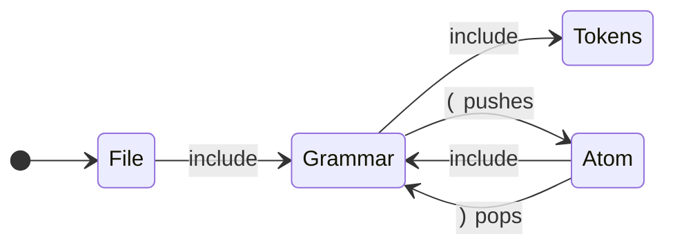

# The Kate generator

```
pyperg generate mygrammar.mgff -g kate -o out/
```

This backend writes a **KDE syntax definition**: the XML format that Kate,
KWrite and KDevelop read for syntax highlighting, and that pandoc reads through
skylighting when it highlights a fenced code block. One grammar gives one `.xml`
file, ready to drop into `~/.local/share/org.kde.syntax-highlighting/syntax/` or
to pass to `pandoc --syntax-definition`.

The backend reads two targets, `Lex` and `Parse`, and both start at a macro
named `File`.

---

## How Kate highlights

Kate does not parse. It runs a stack of **contexts** over the text, one line at
a time. A context is an ordered list of rules; at each position Kate tries them
in order and the first one that matches wins, colouring what it matched and
optionally pushing another context, popping back, or staying put.



That machine reads nesting, which is why brackets and comments fold correctly in
Kate. What it cannot do is backtrack, or let a rule call itself. So:

- **`Lex` maps exactly.** A token is a regular pattern, and a regular pattern is
  precisely what a Kate rule matches.
- **`Parse` maps approximately.** The part of a grammar Kate can genuinely
  reproduce is its *nesting*, so that is the part the backend uses; the rest
  contributes its terminals. The output highlights and folds what your grammar
  describes, but it does not reject what your grammar would reject. If you need
  a real parser, that is what the other backends are for.

---

## The `Lex` target

`File` is the starting production, and it lists the tokens in the order Kate
should try them:

```mgff
t Lex (
    d Digit = 0-9
    d Int   = ( Digit )+
            > class(DecVal)

    d File = ( Space / Comment / Keyword / Int / Ident )*
)
```

Two things follow from writing it this way.

**Order is yours.** Kate takes the first rule that matches, so the order in
`File` is how you say that a keyword beats an identifier, or that a comment beats
an operator.

**Only what `File` names becomes a rule.** `Digit` above is a helper: it is
inlined into the expression for `Int` and never tried on its own. Nothing is
matched that the grammar did not ask for.

Inside a production, a length-based choice (`|`) is emitted longest match first,
so `<=` is tried before `<` without you having to order it by hand. An
order-based choice (`/`) is emitted as written.

A `Lex` production that reaches itself is an error: a Kate rule matches with an
expression, and an expression cannot recurse.

## The `Parse` target

`File` is the starting production here too. From it the backend looks for
**bracketing productions** — a production with an alternative that opens and
closes with a fixed character:

```mgff
t Parse (
    d Atom = Number
           / Ident
           / \( Expr \)

    d Expr = Atom Op Expr
           / Atom

    d File = ( Expr )*
)
```

`Atom` brackets with `(` and `)`, so it becomes a context of its own: `(` pushes
it and opens a foldable region, `)` pops it and closes one. `Expr` brackets
nothing, so it contributes its terminals and no context.

Four contexts come out of a grammar with both targets:

| Context   | What it holds                                                              |
| --------- | -------------------------------------------------------------------------- |
| `File`    | The initial context. An entry point and nothing else.                       |
| `Grammar` | What may appear anywhere: the bracket rules, then the tokens, then any loose terminals the `Parse` rules mention. |
| `Tokens`  | The `Lex` rules.                                                            |
| `<Name>`  | One per bracketing production, popped by its closing character.             |

The bracket rules come before the tokens, so `(` opens its context rather than
being eaten by an `LParen` token of the same shape. Loose terminals come last,
so a character that is already a token is matched as that token.

A grammar with only a `Lex` target starts at `Tokens` and stops there. A target
that is neither `Lex` nor `Parse` is skipped, with a note on standard error.

---

## Attributes

### `class(Class1 Class2 …)`

Kate gives every rule an *itemData*, and every itemData a **default style** —
`dsKeyword`, `dsComment`, `dsString` and so on. A theme colours the default
styles, and skylighting maps them onto pandoc's token types. The default style
is therefore the whole of what a highlighted token *means*, and `class` is how
you choose one:

```mgff
d Keyword = i f
          | e l s e
        > class(Keyword)
```

gives

```xml
<keyword String="keyword" attribute="Keyword"/>
…
<itemData name="Keyword" defStyleNum="dsKeyword"/>
```

A class is passed through as it is written, so anything in this list reaches
Kate as that exact style:

| | | | |
| --- | --- | --- | --- |
| `Normal` | `Keyword` | `Function` | `Variable` |
| `ControlFlow` | `Operator` | `BuiltIn` | `Extension` |
| `Preprocessor` | `Attribute` | `Char` | `SpecialChar` |
| `String` | `VerbatimString` | `SpecialString` | `Import` |
| `DataType` | `DecVal` | `BaseN` | `Float` |
| `Constant` | `Comment` | `Documentation` | `Annotation` |
| `CommentVar` | `RegionMarker` | `Information` | `Warning` |
| `Alert` | `Error` | `Others` | |

The match ignores capitalisation, so `class(keyword)` and `class(Keyword)` are
the same thing.

**Several classes.** Kate allows one style per rule, so when you give several,
the first one naming a default style decides the colour and all of them are
joined with `.` to name the itemData:

```mgff
d Number = ( Digit )+ ( . ( Digit )+ )?
        > class(Float Literal)
```

```xml
<itemData name="Float.Literal" defStyleNum="dsFloat"/>
```

Nothing is rejected. A class naming no default style is kept in the itemData
name and nothing more, which is enough for a Kate theme to target it by name; if
*no* class names a style, the token is `dsNormal`. This is how you keep a
distinction the default styles do not make — `class(Keyword Control)` and
`class(Keyword Modifier)` are both keywords to a theme that does not care, and
two different things to one that does.

### `autoclass`

`autoclass` asks for the class to be derived from the macro's own name, which is
usually enough:

```mgff
d Comment = # ( Anything )*
        > autoclass
```

The name is tried four ways, in order, and the first that answers wins:

1. **The name is a default style.** `Comment`, `Keyword`, `String` — matched
   ignoring capitalisation.
2. **The name is a known synonym.** The table below.
3. **A word of the name is one of the above.** The name is split at separators
   and at case changes, and the **last** matching word wins, because the last
   word says what the token is and the ones before it only qualify it. So
   `LineComment` is a `Comment` and `HexNumber` is whatever `Number` is.
4. **Nothing matched.** The token is `Normal`, and a line goes to standard error
   naming the macro, so you know to write an explicit `class` for it.

The synonyms:

| Style | Names |
| --- | --- |
| `Variable` | `ident`, `identifier`, `name`, `symbol`, `var` |
| `DecVal` | `number`, `num`, `int`, `integer`, `digit`, `digits` |
| `Float` | `real`, `double` |
| `BaseN` | `hex`, `oct`, `octal`, `bin`, `binary` |
| `String` | `str`, `text`, `quoted` |
| `Char` | `character`, `charlit` |
| `SpecialChar` | `escape` |
| `Keyword` | `kw`, `keywords`, `reserved`, `tag` |
| `BuiltIn` | `builtin` |
| `DataType` | `type`, `datatype` |
| `Function` | `func`, `fun`, `call` |
| `Constant` | `const`, `literal` |
| `ControlFlow` | `flow`, `control` |
| `Operator` | `op`, `ops` |
| `Comment` | `comments`, `line_comment`, `block_comment` |
| `Documentation` | `doc`, `docs` |
| `Preprocessor` | `pragma`, `directive` |
| `Import` | `include`, `use` |
| `Attribute` | `attr` |
| `Others` | `label` |
| `Normal` | `punct`, `punctuation`, `space`, `spaces`, `whitespace`, `ws`, `newline`, `lparen`, `rparen`, `lbrace`, `rbrace`, `lbracket`, `rbracket`, `comma`, `semicolon` |

Prefer `autoclass` while a grammar is taking shape, and an explicit `class` for
anything the derivation gets wrong — an explicit `class` is never second-guessed.

A production carrying neither attribute is `Normal`.

### Naming a list of attributes

An attribute-only macro is a named list of attributes, and naming it among
another macro's attributes splices it in. This is the tidy way to give many
tokens the same treatment:

```mgff
d Highlighted > autoclass

t Lex (
    d Ident = Letter ( AlNum )*
        > Highlighted
)
```

### `token`, `skip` and `string`

These are the attributes the other backends use, and the Kate backend passes
over them. It is worth being clear why `skip` in particular does nothing here:
Kate has no notion of discarding a token, since every character of a document
must be coloured as *something*. A skipped token is still highlighted — usually
as `Normal`, which is what makes it invisible.

### Describing the language

A file-scope attribute-only macro named `Language` fills in the root element:

```mgff
d Language > name(Toy) section(Sources) extensions(*.toy) mimetype(text/x-toy)
```

| Attribute | Default |
| --- | --- |
| `name` | The grammar file's name, in Pascal case. Also names the output file. |
| `section` | `Sources` |
| `extensions` | `*.<name in lower case>` |
| `version` | `1` |
| `kateversion` | `5.79` |
| `mimetype`, `author`, `license`, `priority` | Left out. |
| `casesensitive` | `1` |
| `weakDeliminator`, `additionalDeliminator` | Left out. |

An attribute written with several arguments joins them with a space, so
`extensions(*.toy *.t)` reaches Kate as the list it looks like.

---

## Matching characters

Kate offers a dozen ways to match text and tries every rule of a context at
every position, so the choice matters: `DetectChar` compares one character,
while `RegExpr` starts an expression engine. The backend walks this table top to
bottom and takes the first row that fits.

| Rule | Chosen for | Example |
| --- | --- | --- |
| `DetectSpaces` | A run of whitespace. | `( \_\|\t )+` |
| `DetectChar` | One fixed character. | `+` |
| `Detect2Chars` | Two fixed characters. | `< =` |
| `WordDetect` | A longer fixed string, beginning and ending inside a word. | `t h e n` |
| `StringDetect` | Any other fixed string. | `- - >` |
| `AnyChar` | One character out of a handful of fixed ones. | `+\|-\|*` |
| `keyword` | A choice of fixed words, collected into a `<list>`. | `i f \| e l s e` |
| `RegExpr` | Anything else with a regular form. | `( Digit )+` |

`RangeDetect` is deliberately not used. It matches everything between a fixed
opening and closing character, which is wider than any grammar that spells out
what may appear between them, and quietly widening a rule is worse than paying
for an expression.

### Why fusing matters

MGFF has no multi-character literal: a part of a character set is one character,
so the two-character operator `<=` is written as the two items `< =`. Before
choosing a rule the backend **fuses** runs of single-character nodes back into
strings, which is what makes everything from `DetectChar` to `StringDetect`
reachable at all. Without it, `< =` would become the expression `<=`, and a
keyword list would never be recognised.

### Character sets and Unicode

A character set becomes a character class, and a Unicode category becomes
`\p{…}`, which both Kate's engine and skylighting's understand:

| Written | Emitted |
| --- | --- |
| `a` | `a` |
| `0-9` | `[0-9]` |
| `a-z\|A-Z\|_` | `[a-zA-Z_]` |
| `Lu` | `\p{Lu}` |
| `Letter\|Decimal_Number\|_` | `[\p{L}\p{Nd}_]` |

Both spellings of a category work — the two-letter abbreviation `Lu` and the
long form `Uppercase_Letter` — as do the group names `Letter`, `Number`, `Mark`,
`Punctuation`, `Symbol`, `Separator` and `Other`.

### Choice and preference

Regular expressions take the first alternative that succeeds, which is MGFF's
`/`. For `|`, whose match is the longest, the options are ordered longest fixed
option first. That is exact whenever the options have fixed lengths — the usual
case, `<=` before `<` — and an approximation otherwise. The same ordering is
applied when a production becomes several rules, since Kate too takes the first
rule that matches.

---

## A worked example

`tests/fixtures/kate.mgff` is a small language written to exercise all of the
above. Generating from it:

```
pyperg generate tests/fixtures/kate.mgff -g kate -o out/
```

gives `out/Toy.xml`:

```xml
<?xml version="1.0" encoding="UTF-8"?>
<!DOCTYPE language SYSTEM "language.dtd">
<language name="Toy" version="1" kateversion="5.79" section="Sources"
          extensions="*.toy" mimetype="text/x-toy">
  <highlighting>
    <list name="keyword">
      <item>let</item>
      <item>if</item>
      <item>else</item>
      <item>while</item>
    </list>
    <contexts>
      <context name="File" attribute="Normal" lineEndContext="#stay">
        <IncludeRules context="Grammar"/>
      </context>
      <context name="Grammar" attribute="Normal" lineEndContext="#stay">
        <DetectChar char="(" attribute="Normal" context="Atom" beginRegion="Atom"/>
        <IncludeRules context="Tokens"/>
      </context>
      <context name="Atom" attribute="Normal" lineEndContext="#stay">
        <DetectChar char=")" attribute="Normal" context="#pop" endRegion="Atom"/>
        <IncludeRules context="Grammar"/>
      </context>
      <context name="Tokens" attribute="Normal" lineEndContext="#stay">
        <DetectSpaces attribute="Normal"/>
        <RegExpr String="#[\p{L}\p{Nd} \t]*" attribute="Comment"/>
        <keyword String="keyword" attribute="Keyword"/>
        <RegExpr String="[0-9]+(?:\.[0-9]+)?" attribute="Float.Literal"/>
        <RegExpr String="[\p{L}_][\p{L}\p{Nd}_]*" attribute="Variable"/>
        <Detect2Chars char="&lt;" char1="=" attribute="Operator"/>
        <Detect2Chars char="&gt;" char1="=" attribute="Operator"/>
        <Detect2Chars char="=" char1="=" attribute="Operator"/>
        <DetectChar char="+" attribute="Operator"/>
        <DetectChar char="-" attribute="Operator"/>
        <DetectChar char="*" attribute="Operator"/>
        <DetectChar char="=" attribute="Operator"/>
        <DetectChar char="(" attribute="Normal"/>
        <DetectChar char=")" attribute="Normal"/>
      </context>
    </contexts>
    <itemDatas>
      <itemData name="Normal" defStyleNum="dsNormal"/>
      <itemData name="Comment" defStyleNum="dsComment"/>
      <itemData name="Keyword" defStyleNum="dsKeyword"/>
      <itemData name="Float.Literal" defStyleNum="dsFloat"/>
      <itemData name="Variable" defStyleNum="dsVariable"/>
      <itemData name="Operator" defStyleNum="dsOperator"/>
    </itemDatas>
  </highlighting>
  <general>
    <keywords casesensitive="1"/>
  </general>
</language>
```

Reading it back against the grammar: the four keywords became a hashed list, the
length-based operators put their two-character forms first, `class(Float
Literal)` kept both classes in the itemData name while colouring as a float,
`autoclass` found `Comment` by name and `Variable` through `Ident`, and the
bracketing `Atom` production became a context that folds.

### Trying it out

```bash
# In Kate
cp out/Toy.xml ~/.local/share/org.kde.syntax-highlighting/syntax/
kate sample.toy

# In pandoc
pandoc --syntax-definition out/Toy.xml sample.md -o sample.html
```

---

## Limitations

- **`Parse` output is an approximation.** It highlights and folds; it does not
  validate. A grammar that accepts only well-formed input will still colour
  malformed input.
- **No recursive tokens.** A `Lex` production that reaches itself is rejected,
  because a Kate rule matches with an expression.
- **One style per rule.** Extra classes survive in the itemData name, but Kate
  colours by the first one that names a default style.
- **Longest-match choice is ordered, not measured.** For `|` the options are
  emitted longest fixed option first, which is exact for fixed-length options
  and an approximation otherwise.
- **No case-insensitive matching.** MGFF has no spelling for it, so keywords are
  case-sensitive unless `Language > casesensitive(0)` says otherwise.
- **Nothing is skipped.** Kate colours every character, so `skip` has no
  meaning here.
