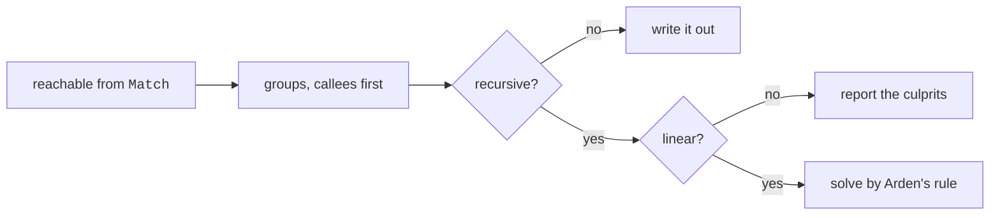

# The regular-expression generator

```
pyperg generate mygrammar.mgff -g regex -o out/
```

This backend writes a single **regular expression**: one `.regex` file holding
the pattern, in the PCRE dialect that Python's `regex` module, PHP, Perl, Java
and Qt all read. A Unicode category becomes `\p{Lu}`, and every group the
grammar does not ask to capture is written `(?: … )`.

A regular expression is far less than MGFF describes, and this backend is honest
about the gap: what has a regular form is generated, and what has none is
reported, naming the productions at fault.

---

## The grammar it reads

Two rules, and everything else is ordinary MGFF.

**The expression starts at `Match`.** Whatever that macro matches is what the
pattern matches; every other macro is reached from it.

**There are no targets.** One expression is one pass over the text, so there is
nothing for a `Lex` and a `Parse` phase to be. Write the macros at file scope. A
grammar carrying a target is reported rather than quietly flattened.

```
d Space  = ( \_|\t )*
d Word   = ( a-z|A-Z|_ )+
d Digits = 0-9 Digits
         / 0-9

d Match = Space key:( Word ) Space = Space value:( Digits / Word ) Space
```

```
[ \t]*(?P<key>[a-zA-Z_]+)[ \t]*=[ \t]*(?P<value>(?:[0-9]*[0-9]|[a-zA-Z_]+))[ \t]*
```

## Capture groups

A capture group is written as a name, a colon, and the rule it wraps:

| Written as        | Generated as    | Read back by             |
| ----------------- | --------------- | ------------------------ |
| `name:( rule )`   | `(?P<name>…)`   | the name                 |
| `:( rule )`       | `(…)`           | its position             |

The name follows the usual rule for one: a letter or an underscore, then letters,
digits or underscores.

A group belongs to the item it is written on, so a quantifier needs a group of
its own around it — `( word:( a-z ) )+` repeats the capture, while `word:( a-z )+`
is no capture at all and is reported as an unknown name.

A production is written into the expression once for every place that calls it,
and no engine allows one name to appear twice. Calling a production that carries
a named group from two places is therefore reported; leave the group unnamed, or
give the second use a production of its own.

## What can be generated, and what cannot

A regular expression has no recursion. A grammar may still write itself
recursively and describe a regular language all the same, so recursion is solved
rather than rejected out of hand.

The productions are gathered into **groups that call each other**, and each group
is solved once everything it calls is a finished pattern. A group that recurses
must be **linear**: every recursive call sits at the very start, or at the very
end, of the alternative it appears in. Arden's rule then turns the recursion into
a repetition.

```
X = A X + B   ⇒   X = A* B          right-linear, the call at the end
X = X A + B   ⇒   X = B A*          left-linear, the call at the start
```

Mutual recursion is solved the same way, as one system: the variables are
eliminated one at a time until each production is left with a pattern.



What has no regular form is **self-embedding**: a call with text on both sides
of it, which is how nesting is written and what a regular expression famously
cannot match.

```
d Match = \( Match \)
        / a
```

```
error: this grammar is not regular, so it cannot be written as one expression:
  Match: a recursive call has text on both sides of it
```

Every production at fault is named, not only the first, so a grammar with
several is fixed in one pass. The reasons reported are:

| Reason                                                | What it means                                            |
| ----------------------------------------------------- | -------------------------------------------------------- |
| a recursive call has text on both sides of it         | self-embedding: nesting, which no expression matches      |
| a recursive call is nested inside a repetition, a choice or a group | the call is not at the edge of the alternative |
| an alternative calls this group of productions twice  | branching recursion, such as `d Match = Match + Match`    |
| the group recurses at the start of one alternative and the end of another | neither left- nor right-linear as a whole |

A production whose every alternative recurses never finishes, so it matches
nothing at all; that is reported too.

## Choice, and the longest match

MGFF's `/` takes the first alternative that succeeds, which is exactly what
alternation does, so an order-based choice maps precisely.

MGFF's `|` takes the **longest** match, which alternation cannot express. The
options are emitted longest fixed option first, which is exact when the options
have fixed lengths — `<=` before `<`, the case the marker exists for — and an
approximation otherwise. Inside a group of productions solved by Arden's rule the
distinction is lost entirely: elimination rewrites the alternatives, and there is
nothing left for the marker to attach to.

## What the file holds

One line: the pattern, and nothing else. It is not anchored, so a caller decides
between searching and matching the whole of the text — `re.fullmatch` in Python,
`\A(?: … )\z` where the pattern is embedded in a larger one.
