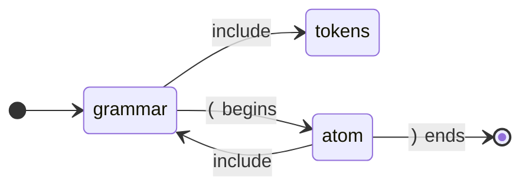

# The TextMate generator

```
pyperg generate mygrammar.mgff -g textmate -o out/
```

This backend writes a **TextMate grammar**: the format Visual Studio Code
highlights with, and the one Sublime Text, Zed, shiki and GitHub's linguist read
too. VS Code's engine reads nothing else — there is no way to hand it a KDE
syntax definition, and a language server does not replace a grammar, since
semantic tokens refine a highlighting that must already exist.

Highlighting is only part of what VS Code calls language support, so one grammar
gives a folder that is a working extension:

```
out/
├── package.json                    what the language is called, and what it owns
├── language-configuration.json     brackets, folding, auto-closing, comments
└── syntaxes/
    └── Toy.tmLanguage.json         the grammar itself
```

Try it without installing anything:

```sh
code --extensionDevelopmentPath=$PWD/out sample.toy
```

or copy the folder into `~/.vscode/extensions/` to keep it. A project that only
wants the grammar — to feed shiki, say — can take the one file and ignore the
other two.

The backend reads two targets, `Lex` and `Parse`, and both start at a macro
named `File`.

---

## How TextMate highlights

TextMate runs a stack of **patterns** over the text, one line at a time. A
`match` pattern consumes what it matched. A `begin`/`end` pattern pushes, matches
its own nested patterns until the `end` expression fires, and pops.



That is a pushdown machine over text — the same machine Kate's contexts are — so
the two highlighting backends read a grammar identically and differ only in how
they spell the answer:

| Kate | TextMate |
| --- | --- |
| a context | a repository entry |
| a rule pushing a context | `begin` / `end`, with nested `patterns` |
| `#pop` | the `end` expression |
| `IncludeRules` | `{"include": "#name"}` |
| an itemData and its default style | a scope name |
| a `<list>` of keywords | `\b(?:a\|b\|c)\b` |
| `DetectChar`, `WordDetect`, `AnyChar`, … | all just `match`, since TextMate has one way to match |

And so the same two conclusions hold:

- **`Lex` maps exactly.** A token is a regular pattern, and a regular pattern is
  precisely what a `match` matches.
- **`Parse` maps approximately.** The part of a grammar a pushdown machine can
  genuinely reproduce is its *nesting*, so that is the part the backend uses.
  The output highlights and folds what your grammar describes; it does not
  reject what your grammar would reject.

---

## The `Lex` target

`File` lists the tokens in the order they should be tried:

```mgff
t Lex (
    d Digit = 0-9
    d Int   = ( Digit )+
            > class(DecVal)

    d File = ( (Space)/(Comment)/(Keyword)/(Int)/(Ident) )*
)
```

Mind the spelling of the choice: it carries no whitespace around its separator,
since a space there would split it into separate items.

**Each token becomes a repository entry of its own**, and `tokens` includes them
in order:

```json
"tokens": {
  "patterns": [{ "include": "#space" }, { "include": "#int" }]
},
"int": {
  "name": "constant.numeric.integer.toy",
  "match": "[0-9]+"
}
```

Splitting them up costs nothing at run time and makes the output worth reading —
and worth editing, if you ever need to hand-tune one pattern.

**Order is yours.** TextMate takes the first pattern that matches at a position,
so the order in `File` is how you say that a keyword beats an identifier.

**Only what `File` names becomes a pattern.** `Digit` above is a helper: it is
inlined into the expression for `Int` and never tried on its own.

A `Lex` production that reaches itself is an error, because a `match` is an
expression and an expression cannot recurse. Nesting belongs to `Parse`.

## The `Parse` target

From `File` the backend looks for **bracketing productions** — a production with
an alternative that opens and closes with a fixed character:

```mgff
t Parse (
    d Atom = Number
           / Ident
           / \( Expr \)

    d Expr = Atom Op Expr
           / Atom

    d File = ( Expr )*
)
```

`Atom` brackets with `(` and `)`, so it becomes a span of its own:

```json
"atom": {
  "name": "meta.atom.toy",
  "begin": "\\(",
  "beginCaptures": { "0": { "name": "punctuation.section.atom.begin.toy" } },
  "end": "\\)",
  "endCaptures": { "0": { "name": "punctuation.section.atom.end.toy" } },
  "patterns": [{ "include": "#grammar" }]
}
```

Including `grammar` back into the span is what makes the nesting recursive, and
is the one thing a `match` pattern could not have done. `Expr` brackets nothing,
so it contributes nothing.

The repository a grammar with both targets produces:

| Entry | What it holds |
| --- | --- |
| `grammar` | What may appear anywhere: the bracketing spans, then the tokens. |
| `tokens` | The `Lex` patterns, in order. |
| `<name>` | One per token, and one per bracketing production. |

The bracket spans come before the tokens, so `(` opens its span rather than
being eaten by an `LParen` token of the same shape.

A grammar with only a `Lex` target starts at `tokens` and stops there. A target
that is neither `Lex` nor `Parse` is skipped, with a note on standard error.

### One thing Kate must do and this backend does not

Kate colours every character of a document, so a `Parse` grammar's loose
terminals — the operators and separators it writes inline — have to be matched
by *something*. TextMate leaves unmatched text at the editor's default colour,
which is exactly what those terminals would have been given anyway, so they are
left out and the output is that much smaller.

---

## Scope names

A TextMate grammar says what a token *is* by giving it a **scope name**: a dotted
path such as `keyword.control.toy`. A theme matches a scope by prefix and
colours the longest prefix it knows, which is why the path runs general to
specific and ends in the language's own identifier — so two languages that both
have keywords can still be themed apart.

The `class` and `autoclass` attributes are exactly the ones the Kate backend
reads, and mean the same thing; only the spelling of the result differs. See
[the Kate generator's documentation](kate-generator.md#attributes) for
`autoclass`, the synonym table and named attribute lists.

| `class` | Scope prefix | | `class` | Scope prefix |
| --- | --- | --- | --- | --- |
| `Normal` | *(none)* | | `DataType` | `storage.type` |
| `Keyword` | `keyword` | | `DecVal` | `constant.numeric.integer` |
| `Function` | `entity.name.function` | | `BaseN` | `constant.numeric.other` |
| `Variable` | `variable.other` | | `Float` | `constant.numeric.float` |
| `ControlFlow` | `keyword.control` | | `Constant` | `constant.language` |
| `Operator` | `keyword.operator` | | `Comment` | `comment` |
| `BuiltIn` | `support.function.builtin` | | `Documentation` | `comment.block.documentation` |
| `Extension` | `support.other` | | `Annotation` | `entity.name.function.decorator` |
| `Preprocessor` | `meta.preprocessor` | | `CommentVar` | `comment.block.documentation.variable` |
| `Attribute` | `entity.other.attribute-name` | | `RegionMarker` | `comment.other.region` |
| `Char` | `string.quoted.single` | | `Information` | `comment.other.information` |
| `SpecialChar` | `constant.character.escape` | | `Warning` | `invalid.deprecated` |
| `String` | `string.quoted.double` | | `Alert` | `invalid.illegal.alert` |
| `VerbatimString` | `string.quoted.other` | | `Error` | `invalid.illegal.error` |
| `SpecialString` | `string.interpolated` | | `Others` | `entity.other` |
| `Import` | `keyword.control.import` | | | |

**`Normal` is no scope at all.** Unmatched text in TextMate already shows in the
editor's default colour, so a pattern that names nothing is exactly right for
whitespace and punctuation. Where Kate has to say `dsNormal`, this says nothing.

**Several classes.** The first class a theme knows contributes the prefix, and
every other class follows as a segment of its own — the same idea as Kate's
dotted itemData name:

```mgff
d Number = ( Digit )+ ( . ( Digit )+ )?
        > class(Float Literal)
```

```json
"name": "constant.numeric.float.literal.toy"
```

A theme that only knows `constant.numeric` colours it as a number; one that
wants to pick out your literals can match the whole path. A class naming no
known prefix still becomes a segment, so `class(Mine)` gives `mine.toy`.

---

## Matching characters

There is one way to match text — an [Oniguruma][oniguruma] regular expression —
so there is no table of rules to choose from and no reason to break a production
into several patterns. A production becomes **one** expression, which is both
the fastest thing TextMate can do and the most readable output.

Character sets and Unicode categories work exactly as they do for Kate:

| Written | Emitted |
| --- | --- |
| `a` | `a` |
| `0-9` | `[0-9]` |
| `a-z\|A-Z\|_` | `[a-zA-Z_]` |
| `Lu` | `\p{Lu}` |
| `Letter\|Decimal_Number\|_` | `[\p{L}\p{Nd}_]` |

### Word boundaries

Kate's `keyword` and `WordDetect` rules only match between word boundaries.
TextMate has no such rule, so a production whose alternatives are **all plain
words** is wrapped in `\b…\b`:

```mgff
d Keyword = l e t
          | i f
          | e l s e
          | w h i l e
        > class(Keyword)
```

```json
"match": "\\b(?:while|else|let|if)\\b"
```

Without the boundaries the `if` of `iffy` would be coloured as a keyword. Unlike
Kate this applies to a single-word production too, since `\b` costs nothing
where Kate would have had to pay for a slower rule.

### Choice and preference

Regular expressions take the first alternative that succeeds, which is MGFF's
`/`. For `|`, whose match is the longest, the options are ordered longest fixed
option first — exact whenever the options have fixed lengths, which is the usual
case of `<=` before `<`, and an approximation otherwise. Note above that the
boundaries also repair an order-based choice: `\b(?:if|iffy)\b` still matches
`iffy` whole, because `if` cannot end in the middle of a word.

---

## The extension around the grammar

### Brackets come from the grammar

VS Code folds, matches and auto-closes by the pairs in
`language-configuration.json` — **not** by anything in the TextMate grammar. So
the bracketing productions reach both files: the grammar, as the spans they
highlight, and the configuration, as the pairs the editor folds:

```json
{
  "brackets": [["(", ")"]],
  "autoClosingPairs": [{ "open": "(", "close": ")" }],
  "surroundingPairs": [["(", ")"]]
}
```

This is why `Parse` is worth writing even though its highlighting contribution
is modest: folding and bracket matching come out of it for free.

### Comment markers are not guessed

Comment toggling (<kbd>Ctrl</kbd>+<kbd>/</kbd>) needs a marker, and the backend
will not derive one from a `Comment` production. Its leading literal looks like
a line-comment marker and frequently is not — a block comment opens the same way
— and toggling with the wrong marker damages a file. Say so instead:

```mgff
d Language > lineComment(#) blockComment(#{ #})
```

### Describing the language

A file-scope attribute-only macro named `Language` fills in the manifest. Most
of it is shared with the Kate backend, so one grammar can describe itself once
and generate both.

| Attribute | Default |
| --- | --- |
| `name` | The grammar file's name, in Pascal case. Also names the grammar file. |
| `id` | `name` split into words and joined with `-`, in lower case, so `MyToy` gives `my-toy`. Every scope name ends in it. |
| `scope` | `source.<id>`. A grammar describing markup should say `text.<id>` instead. |
| `extensions` | `*.<id>`. Written as globs, as Kate wants them, and rewritten to `.toy` for VS Code. |
| `version` | `0.0.1`. A manifest needs a semantic version, so a plain `version(1)` written for Kate is padded out to `1.0.0` rather than rejected. |
| `description` | `<name> language support.` |
| `mimetype`, `publisher`, `license` | Left out. |
| `lineComment`, `blockComment` | Left out; see above. |

`section`, `kateversion`, `priority` and the deliminator settings are Kate's
alone and are ignored here.

---

## A worked example

`tests/fixtures/textmate.mgff` is the same small language `kate.mgff` describes,
plus the settings only an editor extension needs. Generating from it gives:

```json
{
  "name": "Toy",
  "scopeName": "source.toy",
  "fileTypes": ["toy"],
  "patterns": [{ "include": "#grammar" }],
  "repository": {
    "grammar": {
      "patterns": [{ "include": "#atom" }, { "include": "#tokens" }]
    },
    "atom": {
      "name": "meta.atom.toy",
      "begin": "\\(",
      "beginCaptures": { "0": { "name": "punctuation.section.atom.begin.toy" } },
      "end": "\\)",
      "endCaptures": { "0": { "name": "punctuation.section.atom.end.toy" } },
      "patterns": [{ "include": "#grammar" }]
    },
    "tokens": {
      "patterns": [
        { "include": "#space" }, { "include": "#comment" },
        { "include": "#keyword" }, { "include": "#number" },
        { "include": "#ident" }, { "include": "#op" },
        { "include": "#lparen" }, { "include": "#rparen" }
      ]
    },
    "space":   { "match": "[ \\t]+" },
    "comment": { "name": "comment.toy", "match": "#[\\p{L}\\p{Nd} \\t]*" },
    "keyword": { "name": "keyword.toy", "match": "\\b(?:while|else|let|if)\\b" },
    "number":  { "name": "constant.numeric.float.literal.toy",
                 "match": "[0-9]+(?:\\.[0-9]+)?" },
    "ident":   { "name": "variable.other.toy", "match": "[\\p{L}_][\\p{L}\\p{Nd}_]*" },
    "op":      { "name": "keyword.operator.toy", "match": "(?:<=|>=|==|\\+|-|\\*|=)" },
    "lparen":  { "match": "\\(" },
    "rparen":  { "match": "\\)" }
  }
}
```

Reading it back against the grammar: the four keywords became one bounded
alternation, the length-based operators put their two-character forms first,
`class(Float Literal)` kept both classes in the scope while colouring as a
float, `autoclass` found `Comment` by name and `Variable` through `Ident`,
`class(Normal)` left `Space` and the parentheses unscoped, and the bracketing
`Atom` production became a span that nests — and a bracket pair that folds.

---

## Limitations

- **`Parse` output is an approximation.** It highlights and folds; it does not
  validate. A grammar that accepts only well-formed input will still colour
  malformed input.
- **No recursive tokens.** A `Lex` production that reaches itself is rejected,
  because a `match` is an expression. Nesting has to be written as a bracketing
  `Parse` production.
- **One line at a time.** A pattern is matched within a line, so a token cannot
  span one. A construct that does has to be written as a bracketing production,
  which is what `begin`/`end` is for.
- **Longest-match choice is ordered, not measured.** For `|` the options are
  emitted longest fixed option first, which is exact for fixed-length options
  and an approximation otherwise.
- **No case-insensitive matching.** MGFF has no spelling for it.
- **A token that can match nothing is left out**, with a note on standard error.
  A zero-width pattern makes no progress and so can never highlight anything.
- **Nothing is skipped.** As with Kate, `skip` has no meaning: an editor shows
  every character, and a token styled `Normal` is what "invisible" means here.

[oniguruma]: https://github.com/kkos/oniguruma/blob/master/doc/RE
